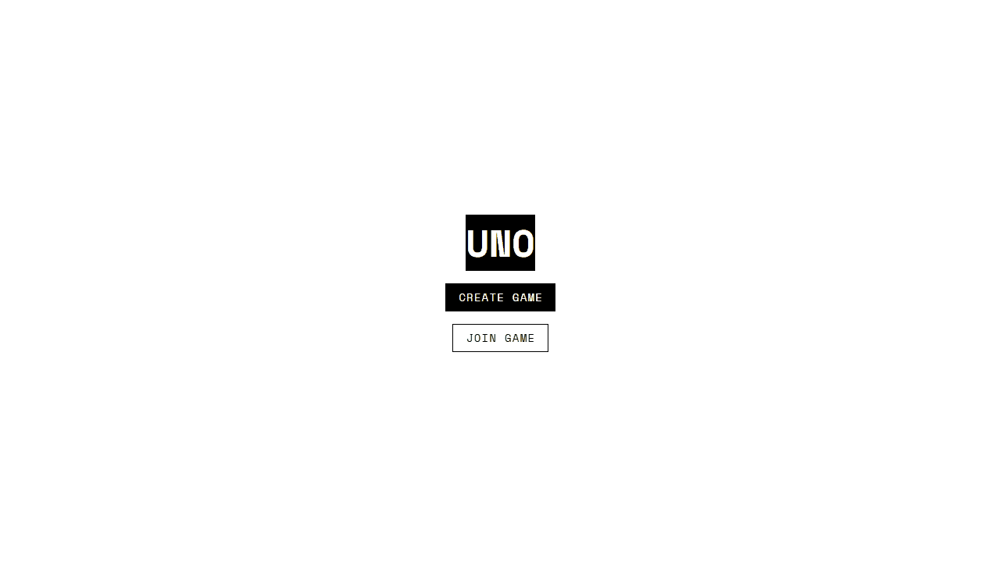

# Card Game

This is a web-based version of the classic **Uno card game**. The backend for this project was developed by [@vninomtz](https://github.com/vninomtz/card-game).

## Features

- Create new game
- Join to a game
- Lobby to wait until game start
- Play card
- Draw card

## Game demo



## Project Setup

```sh
npm install
```

### Compile and Hot-Reload for Development

```sh
npm run dev
```

## Tech stack

- **Vue.js.** Core framework
- **Vuetify.** UI component library.
- **gsap.** Animation library.

## Playground

This is a dedicated space where we prototyped and tested our core UI components before integrating into the game logic. _Visit: host/Playground_.

### Featured components include:

- BaseCard.
- BaseDeck.
- BaseBoard.
